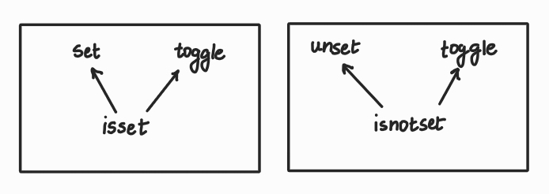
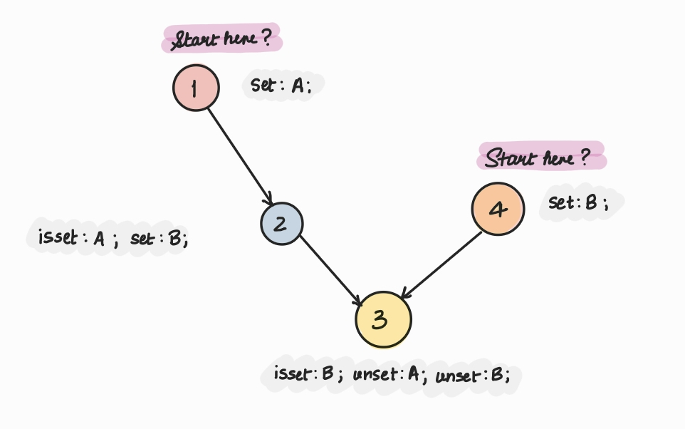

# Suricata flowbits don't always flow

Welcome, reader!

I'm assuming if you've landed on my blog you know what Suricata is, but, if you don't, please check
out https://github.com/OISF/suricata. As a part of my work at Suricata, I was tasked with what looked
like a not so hard (solvable) problem. This problem entailed fixing how Suricata internally orders
the signatures with flowbits for correct and efficient matching against the real world traffic.
Let's first get an idea of what a flowbit is. Learn about Flow [here](https://inliniac.net/blog/2014/07/28/suricata-flow-logging/).
The post is a bit outdated but most of the stuff is still the same. ``flowbits`` are special kinds of bits
that can be set, tracked and modified per flow. These help with:
- State tracking
- Controlling the rule evaluation order
- Progress tracking
per flow.

Examples of flowbits usage from the popular ET Open ruleset:

```diff
alert tcp any any -> $HOME_NET 3389 (msg:"ET DOS Microsoft Remote Desktop (RDP) Session Established Flowbit Set"; flow:established,to_server; flowbits:isset,ms.rdp.synack; flowbits:set,ms.rdp.established; flowbits:unset,ms.rdp.synack; flowbits:noalert; reference:cve,2012-0152; classtype:not-suspicious; sid:2014386; rev:5; metadata:created_at 2012_03_15, signature_severity Major, updated_at 2024_03_14;)
alert tcp any any -> $HOME_NET 3389 (msg:"ET DOS Microsoft Remote Desktop (RDP) Syn then Reset 30 Second DoS Attempt"; flags:R; flow:to_server; flowbits:isnotset,ms.rdp.established; flowbits:isset,ms.rdp.synack; flowbits:unset,ms.rdp.synack; reference:cve,2012-0152; classtype:attempted-dos; noalert; sid:2014384; rev:9; metadata:created_at 2012_03_13, signature_severity Major, updated_at 2024_03_14;)
alert tcp $HOME_NET 3389 -> any any (msg:"ET DOS Microsoft Remote Desktop (RDP) Syn/Ack Outbound Flowbit Set"; flow:from_server; flowbits:isnotset,ms.rdp.synack; flowbits:set,ms.rdp.synack; flowbits:noalert; flags:SA; reference:cve,2012-0152; classtype:not-suspicious; sid:2014385; rev:6; metadata:created_at 2012_03_15, cve CVE_2012_0152, signature_severity Major, updated_at 2024_03_14;)
```

Now, these rules are ordered internally by Suricata in a way that they are evaluated correctly. There
are several properties at play but for the sake of this blog post, we're only concerned with flowbits.
Flowbit rules are ordered as follows:
1. Write operation on flowbits. Rules that SET, UNSET or TOGGLE a flowbit i.e. a state change happens.
2. Write + Read operations on flowbits. Rules that do at least one Write operation and at least one Read operation
   like ISSET or ISNOTSET.
3. Read operation on flowbits. Rules that check if one or more flowbits ISSET or ISNOTSET i.e. no state
   change happens, the existing state is only read.

This has worked fine all this time until we hit an edge case and found that there can exist rules with
complex ordering that is not easily determined by the internal sorting conditionals. The bug report can
be seen [here](https://redmine.openinfosecfoundation.org/issues/7638).

The idea is that in order to be able to "read" a flowbit, it must first be written. So, the rules should
be ordered such that this criteria is preserved for all read and write states.

At first, it looked like a problem about finding the correct sorting order but soon I started to see
edge cases one after the other including [one](https://redmine.openinfosecfoundation.org/issues/7771) "unsatisfiable" at runtime.
So, I went on a quest to find how to resolve dependencies and..


I landed on something called Boolean Satisfiability Problems and it was quite a topic. It took a long time
to understand what it is. I had to.. in order to determine if what I was dealing with also fell in the
same category. Let's understand it in a simplified way with basic examples.


## What are Boolean Satisfiability Problems?

Every problem that can be reduced to a boolean expression such that the said expression can then be
verified to be satisfiable for all inputs.

e.g. ``A ∧ ¬B``  -- this is a basic boolean expression (read as A *and* *not* B)

You understand it well. Your computer understands it well.
Here, A and B are what we call "literals".

An expression can also look like ``(A ∧ ¬B) ∨ (¬A ∧ B)`` -- a sub-expression like ``(A ∧ ¬B)`` is called a "clause".

Simple enough, isn't it? Actually, it's an NP-Complete problem with certain specialized cases even
classified as NP-Hard. Another blog post is due to explain NP-Complete and NP-Hard.
But, are all SAT problems this hard? Not really. As long as the literals stay <= 2, or the clauses
are less, the SAT problem is verifiable in polynomial time with even a scope of finding a solution
in ``O(n + m)``

where, `n` = number of literals

and, `m` = number of clauses

Let's say our problem at hand is finding if the expression ``(A ∧ ¬B)`` is satisfiable at runtime.


**Truth table for ``(A ∧ ¬B)``**

| A | B | Output |Satisfiable |
|---|---|--------|------------|
| 0 | 1 |   0    |No          |
| 0 | 0 |   0    |No          |
| 1 | 1 |   0    |No          |
| 1 | 0 |   1    |Yes!        |

It's an easy problem. So easy in fact that it is easily verifiable using a simple Truth Table.
But, how was this reduced to a SAT problem? Let's now see how SAT problems are represented.

### Representation of a SAT problem

SAT problems are represented in Conjunctive Normal Form (CNF).

#### CNF

Simply put, CNF is a way of expressing a boolean formula using conjunctions of clauses.
So, instead of having an expression like ``A ∨ (B ∧ C)``, a SAT solver would use an algorithm like
[Tseitin encoding](https://people.cs.umass.edu/~marius/class/h250/lec2.pdf) to convert this into a CNF by introducing an auxiliary variable.
It is probably not needed for small expressions but for when there are larger expressions at hand.

The idea is to introduce an auxiliary variable, say ``X`` where  ``X ≡ (B ∧ C)`` and add clauses that would
result in the same outcome as the original expression but all AND'ed. Here, the ``(B ∧ C)`` was the
complex clause whereas ``A`` a standalone literal so ``(B ∧ C)`` was chosen. However, the choice is not that
simple when multiple clauses are present and an [Abstract Syntax Tree](https://en.wikipedia.org/wiki/Abstract_syntax_tree) is used as a part of the
algorithms like _Tseitin encoding_ to determine which expressions must act as the auxiliary variables
so as to easily reduce the expression to CNF.

The given expression with the new auxiliary expression ``X`` comes out to be:

``(A ∨ X) ∧ (¬X ∨ B) ∧ (¬X ∨ C)``

You can see that the outputs remain the same for any values of ``A``, ``B`` and ``C`` as in the original
expression to verify the correctness.

**Truth Table for ``A ∨ (B ∧ C)``**

| A | B | C | Output |
|---|---|---|--------|
| 0 | 0 | 0 |   0    |
| 0 | 1 | 0 |   0    |
| 0 | 0 | 1 |   0    |
| 0 | 1 | 1 |   1    |
| 1 | 0 | 0 |   1    |
| 1 | 1 | 0 |   1    |
| 1 | 0 | 1 |   1    |
| 1 | 1 | 1 |   1    |

**Truth Table for ``(A ∨ X) ∧ (¬X ∨ B) ∧ (¬X ∨ C)``**

| A | B | C | X | Output |
|---|---|---|---|--------|
| 0 | 0 | 0 | 0 |   0    |
| 0 | 1 | 0 | 0 |   0    |
| 0 | 0 | 1 | 0 |   0    |
| 0 | 1 | 1 | 1 |   1    |
| 1 | 0 | 0 | 0 |   1    |
| 1 | 1 | 0 | 0 |   1    |
| 1 | 0 | 1 | 0 |   1    |
| 1 | 1 | 1 | 1 |   1    |


These auxiliary variables are invisible to the final outcome and are introduced for the convenient
conversion to CNF.

##### Why should CNF be used?

- Any expression is reducible to CNF in polynomial time
- Allows for easy conflict analysis; faster exit if any clause were unsatisfiable
- DNF (Distributive Conjunction Form) -- the opposite of CNF can lead to exponential blow up of the formula
- It is complete and standardized distributive formulation

## Applications of SAT

Satisfiability problems are a part of the regular computer science everyday problems like

- CPU scheduling
- Network routing
- Machine Learning decision making
- Package dependency resolutions -- this is something that most of us have fought.

    You may say what's the problem here? My code works fine as it is and my package manager takes
    care of all that needs to be taken care of. At this point, either you're lying to yourself or
    you've broken the internet already. Well, your package manager has.. with its algorithm.

    I've already disclosed that this is a boolean satisfiability problem so why are the
    package managers still working fine? Are they, really?
    Package A depends on Package B >= 0.5 depends on Package C == 2.3 depends on Package D == 7.9.0
    depends on Package B < 0.4 and BAM!

    Sound familiar? 😄

    Package managers work because yes they use incredibly intelligent algorithms that are usually
    backtracking based (you're able to go back to the last good decision -- unlike your life 🙃 )

    but they can always run into "failure" scenarios.

    This is where **you** come in.

    You either upgrade the entire main package, or pin a sub package to a version or decide to keep multiple versions of a
    package, etc and with such assistances, it mostly works out because there's a definite, relatively
    small list of clauses.

    This can however become an NP-Hard problem by increasing the difficulty by a bit (NOT BYTE) 😉
    See: https://stackoverflow.com/questions/28099683/algorithm-for-dependency-resolution

    [YES I GAVE YOU A STACKOVERFLOW LINK AND NOT AN AI PROMPT, DEAL WITH IT!]

    There are excellent package managers out there today like one I briefly analyzed in a hope to find
    solution to my problems 😭: https://pubgrub-rs-guide.pages.dev

    But, in the end, none of them can guarantee to find you a solution.

If it's NP-Complete or worse, why do I still have a working version of all applications mentioned
above? Great question! (Feeling like sycophant AI at this point 🥲)

Because with some assistance and limited variables, there is a chance of finding solutions. However, all
SAT solvers come with a timeout for obvious reasons.

## SAT solvers

Most SAT solvers use either of the following algorithms:

1. **DPLL (Davis–Putnam–Logemann–Loveland)** - A backtracking based search algorithm.
2. **CDCL (Conflict-Driven Clause Learning)** - A smarter backtracking algorithm. It does "backjumping" in
a non-chronological fashion and maintains a database of learnings about conflicts.

Note that in the worst case scenarios, the time complexity is exponential! Since a binary tree is used
to track the states, it comes out to ``O(2ⁿ)``.

We just talked about ``pubgrub`` and turns out it is based on CDCL as well with more things to make it fast,
flexible but as the author (of the algorithm, not just the blog post!) Natalie Weizenbaum explains her
awesome work here: <https://nex3.medium.com/pubgrub-2fb6470504f> the problem remains NP-Hard.

### Read more

1. <https://inria.hal.science/hal-03589602/file/ClementinTayou-mai2021.pdf>
2. <https://www.geeksforgeeks.org/dsa/2-satisfiability-2-sat-problem/>
3. Wikipedia forever <3 <https://en.wikipedia.org/wiki/Boolean_satisfiability_problem>
4. There are international SAT competitions! https://satcompetition.github.io

# Suricata and Flowbits continued...

Now, getting back to the problem at hand. It indeed started to look like a satisfiability problem
but I saw how 2-SAT problems are solved and went head-in to see if I can reduce the problem in a way that
even graphs can solve. And, I found a solution! ...or so I had thought.

## Failed Solution Attempt #1

My target was to find the correct dependency order for complex flowbit ordering, reject any cycles (see graph felt
like a plausible solution if only I could convert the problem) and deal with some inefficient cases of
command combinations that just did not make sense but can exist in theory.

The information available at hand at once is a signature and the flowbits inside this signature along with the
commands that they are used with. So, I decided to make both signatures and flowbits as nodes in the
graph. Now, the challenge was to represent the commands, so it made sense to use directions as the indicator
of READ or WRITE. Quickly, I had an ugly but working [proof of concept](https://github.com/inashivb/blog-code-snippets/blob/master/notebooks/Flowbits%20Dependency%20Resolver%20%7C%20DEMO.ipynb) of an algorithm that passed the existing
tests and the bug that started this quest!

Rough idea was:
1. Bring out the signatures that had Write + Read operations on flowbits.
2. For each signature, add a node of type "signature"
    i. For each flowbit in the signature, add a node of type "flowbit"
    ii. Add a directed edge from the flowbit node to the signature node if the flowbit had a Read command on it
    iii. Add a directed edge from the signature node to the flowbit node if the flowbit had a Write command on it
3. Normalize the graph i.e. remove flowbit nodes as they're inconsequential in the final solution.
4. Check for cycles.
5. Connect any loner nodes (that had no dependency with others) with a dummy node to make them all reachable.
6. If no cycles were found, perform a BFS (Breadth First Search) of what should now be a DAG (Directed Acyclic Graph).

and I hit the first issue soon enough.

I had over generalized the "Read" and "Write" definitions. That meant that a good set of rules like the following:

```
flowbits:isset,A; flowbits:set,B; sid:1;
flowbits:isset,B; flowbits:unset,A; flowbits:unset,B; sid:2;
```

<video width="640" height="480" controls>
  <source src="flowbits_cycle.mp4" type="video/mp4">
</video>

was now rejected for having a cyclic dependency!

## Failed Solution Attempt #2

Now, I had to figure out a way to make sure the commands are respected and not just generalized as Read or
Write. My mentor asked if we could use weights on edges somehow and it seemed like a good thing to try
out. So, now, the algorithm remained mostly the same with some changes:
- each edge had weight of the command that was in use
- if a cycle was formed by edges of varying weights, the edge with higher weight (lower priority command)
  was removed

This was all done in Rust and I used the [Petgraph](https://github.com/petgraph/petgraph) library's StableDiGraph.
I don't know if I was using good Rust practices but well.. it compiled.


I still was not confident and wondered if I was missing more cases and indeed there were. New questions arose:
1. I felt that `isnotset` command was an independent command as per its usage. It was something that was
   used to track the state until the first time something was set. However, my mentor argued that it is a
   dependent command and should be affected by the presence of `unset` and `toggle` commands. So, now the dependency
   states were:

   

2. `unset` seemed invalid to be used without a tie-up with a state.
   e.g.

   ```
   flowbits:isset,A; flowbits:unset,A; sid:1;
   ```

   seemed more correct even if there's an extra operation instead of the open

   ```
   flowbits:unset,A; sid:2;
   ```

   which indicates a reset operation. Now, in the beginning of a flow, the flowbit should anyway be unset, in the
   middle, if there are going to be rules using it, it's probably better to ensure that the flowbit is in fact set
   before unsetting it. The obvious difference is that the ``sid:2`` is going to match unconditionally however,
   ``sid:1`` is going to fail the match in case the flowbit ``A`` was not set.

   After all these failures, it was time for something that should have been done much earlier. Remember the big
   lesson on SAT? Let's put that to use to try and see if this problem can be reduced to SAT and what it might look
   like.

## An attempt at converting this problem to SAT

It turned out to be harder than I had thought. But, going back to the basics, we at least need
- literals
- clauses
- the boolean expression

So, let's turn to the most basic of flowbits rules at first.

```
flowbits:set,A; sid:1;
flowbits:isset,A; sid:2;
```

Here, sid:1 (`s1` from here on) must come before sid:2 (`s2` from here on). This is our dependency criteria.

This can be made into the statement: **s2 depends on s1** or, **if s2 then s1**.
The boolean expression for this statement can be expressed as: ``¬s2 ∨ s1``  (NOT s2 OR s1)

To be sure, our favorite:

| s1 | s2 | Output |
|----|----|--------|
| 0  |  0 |   1    |
| 0  |  1 |   0    |
| 1  |  0 |   1    |
| 1  |  1 |   1    |

The expression is satisfiable in all cases except when s2 exists without s1. This is correct. `isset` without `set`
is invalid and would never result in a match. This is accepted by Suricata but a warning is issued.

Let's use slightly more complex flowbits rules now.

```
flowbits:set,A; sid:1;
flowbits:isset,B; flowbits:set,C; sid:3;
flowbits:isset,A; flowbits:set,B; sid:2;
flowbits:isset,C; sid:4;
```

This is exactly the flowbit and rule structure in the ticket that started this work.
Here, the dependencies look like the following.

Flowbit ``A``: s2 depends on s1 : ``¬s2 ∨ s1``

Flowbit ``B``: s3 depends on s2 : ``¬s3 ∨ s2``

Flowbit ``C``: s4 depends on s3 : ``¬s4 ∨ s3``

Notice how we had to split things out per flowbit to make them legible.

Now, in order to convert it into CNF, we must simply AND all the individual clauses that we were able to come
up with because they all must exist at once for the ruleset containing these 4 rules to be considered satisfiable.

CNF := ``(¬s2 ∨ s1) ∧ (¬s3 ∨ s2) ∧ (¬s4 ∨ s3)``

The truth table for this expression will be:

| s1 | s2 | s3 | s4 | Output |
|----|----|----|----|--------|
|  0 |  0 |  0 |  0 |   1    |
|  0 |  1 |  0 |  0 |   0    |
|  0 |  0 |  1 |  0 |   0    |
|  0 |  1 |  1 |  0 |   0    |
|  1 |  0 |  0 |  0 |   1    |
|  1 |  1 |  0 |  0 |   1    |
|  1 |  0 |  1 |  0 |   0    |
|  1 |  1 |  1 |  0 |   1    |
|  0 |  0 |  0 |  1 |   0    |
|  0 |  1 |  0 |  1 |   0    |
|  0 |  0 |  1 |  1 |   0    |
|  0 |  1 |  1 |  1 |   0    |
|  1 |  0 |  0 |  1 |   0    |
|  1 |  1 |  0 |  1 |   0    |
|  1 |  0 |  1 |  1 |   0    |
|  1 |  1 |  1 |  1 |   1    |

So, this expression is correctly satisfiable in the following cases:

i. None of the rules exist

ii: s1 exists alone

iii: s1 and s2 exist

iv: s1, s2 and s3 exist

v: all signatures exist

Since we are willing to find the exact order of the signatures, our key takeaway is point **v** that states that there
does exist a way for the dependencies to be satisfiable at runtime indeed with all the rules present.
Note that SAT equations are "verifiable" in polynomial time.
This time, I decided to verify my analysis using a SAT solver. One popular and easy choice is [Z3](https://github.com/Z3Prover/z3)
because of the easy Python scripting syntax it offers.

A trivial Z3 script to find the solution to the given expression can be written as:

```Python
from z3 import *

s1, s2, s3, s4 = Bools('s1 s2 s3 s4')

solver = Solver()

# CNF: (¬s2 ∨ s1) ∧ (¬s3 ∨ s2) ∧ (¬s4 ∨ s3)
solver.add(Or(Not(s2), s1))  # ¬s2 ∨ s1
solver.add(Or(Not(s3), s2))  # ¬s3 ∨ s2
solver.add(Or(Not(s4), s3))  # ¬s4 ∨ s3

if solver.check() == sat:
    print("Satisfiable equation :)")
    print("The solution is:")
    res = solver.model()
    print(f"{res}")
else:
    print("Unsatisfiable at runtime :(")
```

I found out that there was problem - Z3 only finds one solution at a time so, we have to "guide" it by blocking
the solutions it has already found (ring a bell?) or use other ways to get *all* the solutions. If you run the above
script, Z3 finds you the easiest solution that is satisfiable: all values set to False.

The script with blocking clause looks like:

```Python
from z3 import *

def find_all_solutions():
    s1, s2, s3, s4 = Bools('s1 s2 s3 s4')
    solver = Solver()

    solver.add(Or(Not(s2), s1))  # ¬s2 ∨ s1
    solver.add(Or(Not(s3), s2))  # ¬s3 ∨ s2
    solver.add(Or(Not(s4), s3))  # ¬s4 ∨ s3

    solutions = []

    while solver.check() == sat:
        model = solver.model()

        solution = {}
        for var in [s1, s2, s3, s4]:
            solution[str(var)] = is_true(model.evaluate(var))

        solutions.append(solution)
        print(f"Solution #{len(solutions)}: {solution}")

        blocking_clause = []
        for var in [s1, s2, s3, s4]:
            if is_true(model.evaluate(var)):
                blocking_clause.append(Not(var))
            else:
                blocking_clause.append(var)

        solver.add(Or(blocking_clause))

    return solutions

all_solutions = find_all_solutions()

```

and the output is:

```
Solution #1: {'s1': False, 's2': False, 's3': False, 's4': False}
Solution #2: {'s1': True, 's2': False, 's3': False, 's4': False}
Solution #3: {'s1': True, 's2': True, 's3': False, 's4': False}
Solution #4: {'s1': True, 's2': True, 's3': True, 's4': False}
Solution #5: {'s1': True, 's2': True, 's3': True, 's4': True}
```

so, the manual solution checking and equation creation checks out!**

Now, how can I automate the creation of the constraints? Notice how in order to create the SAT equation, I had to
break things down per flowbit, so, at least that looks like a good route. This information is not available at the signature
ordering time but it would have to be retrieved. The logical flow requires a map of all sids for each flowbit
per command. This is already somewhat done in Suricata to check inconsistencies among the commands. But, this happens at
end of the entire ordering and grouping and a warning is issued in such a case. We need more though to solve the
ordering problem.
Moving forward, each flowbit will have 5 arrays, let's say we're dealing with the same flowbits in the above example.
There are 3 distinct flowbits.

```
Flowbit A:
  set_sids: [1]
  isset_sids: [2]
  isnotset_sids: []
  toggle_sids: []
  unset_sids: []

Flowbit B:
  set_sids: [2]
  isset_sids: [3]
  isnotset_sids: []
  toggle_sids: []
  unset_sids: []

Flowbit C:
  set_sids: [3]
  isset_sids: [4]
  isnotset_sids: []
  toggle_sids: []
  unset_sids: []
```

Now, we must define the dependency order among the commands. So, far, it seems safe to assume that the following
is acceptable as shown earlier:


Generic constraint evaluation then becomes:

1. for each flowbit:

     create a one to many map of isset_sids and (set_sids and toggle_sids)

     create a one to many map of isnotset_sids and (unset_sids and toggle_sids)
2. Create a consolidated map of all flowbit maps.
3. for each entry (dependent_sid, dependee_sid) in the map

     add a clause `c`: Or(Not(dependent_sid), dependee_sid)

     add the clause to SAT solver: solver.add(`c`)

and that should be our final boolean expression**.

Now, running this boolean expression through a SAT solver should tell you if an arrangement is possible among
the given set of signatures.
But, we just learned that SAT solvers give one solution at a time. Good news is that we can freeze the literals
to a certain value. So, in Z3, for example, we could force any variable to be true:

```
solver.add(s == True)
```

By forcing this constraint, I am basically asking SAT solver if a solution exists if **all** the flowbits rules
were enabled. If there's no solution, we can always go to another possible solution using blocking clauses.

Now, because I know for sure which rules should be enabled to make the ruleset satisfiable at runtime, I can go
back to directed graphs for the actual final solution. Some corrections on the last algorithm based on how I was
able to reduce the problem to SAT are:
1. Node types should only be signatures but all flowbit signatures not just the complex ones like before
2. The dependent-dependee map should be used to create relationships -- Problem that stays: we could
   still run into "unreachable" nodes which is OK but they make it hard to define the order. e.g.



If there's a working algorithm, it could, in theory be used without a SAT solver while rejecting any ruleset that
has unsatisfiable rule paths (cycles).
Ofc the downside is that Suricata would simply reject the ruleset as impossible to match at runtime without any
helpful directions on what needs to be done. SAT solvers can help with a possible solution quickly.

Let's also see what the SAT equation would look like in case of an unsatisfiable ruleset.

```
flowbits:set,A; flowbits:isset,B; sid:1;
flowbits:isset,A; flowbits:set,B; sid:2;
```

Flowbit ``A``: s2 depends on s1 : ``¬s2 ∨ s1``
Flowbit ``B``: s1 depends on s2 : ``¬s1 ∨ s2``

CNF := ``(¬s2 ∨ s1) ∧ (¬s1 ∨ s2)``

Truth table for this expression:

  | s1 | s2 | Output |
  |----|----|--------|
  | 0  |  0 |   1    |
  | 0  |  1 |   0    |
  | 1  |  0 |   0    |
  | 1  |  1 |   1    |

Wut.

SAT solver says that cyclic dependency rules are solvable in two scenarios: Neither rule exists - OK.
Both the rules exist - What? -- It is correct when you think about it. But, fails my usecase.

This, my dear reader was another blip in what was looking like a promising solution. Even SAT solvers and ASP
solvers use directed graphs or ordered clauses to detect cycles as unsatisfiable.


### Outcomes of the SAT solver approach

- While promising, SAT solvers also need guidance for special conditions.
- With correct equations in SAT solvers, if a solution does not exist for all True values, we can remove that constraint
and ask the solver to give a solution, any solution.

**Noticed the stars above? They indicate that the equation although working for the cases at hand are incomplete.
All equations need **ALL** possible clauses which is where Tseitin encoding like algorithms come in. For example, if
A depends on B and B depends on C then apart from these clauses, one must add a transitive clause stating that
A must also depend on C.

## Conclusion

The flowbits ordering issue was successfully reduced to a SAT problem.
Can this all be done in polynomial time? For most practical cases, yes. If one were to stress test it, I don't know.
The complexity goes up with the increase in literals (signatures) and clauses (dependencies created by each flowbit usage).

There are alternatives like [ASP](https://www.cs.utexas.edu/~vl/papers/wiasp.pdf) that look promising. I don't know if I
will explore it but if I do, you'll see in a blog post.

Is this a solution to the problem then?
I don't think so. While this research helped with the direction and clarifying what may or may not work, there are still
edge cases, one of which I mentioned earlier in finding the actual solution.
Stay tuned for the final solution, if any. For now, the battle continues..

### Mandatory Note

I assure you I'm a human and therefore, I am bound to make mistakes. Please feel free to point any obvious mistakes in
the analysis or the content. I decided to write this blog post despite there being no clear indication if this
work is close to a finished state or will be accepted just because this took on and off a lot of research,
failures, trials at different solutions and understanding several new and interesting concepts over a long period of time.

Thanks for reading! 😺
